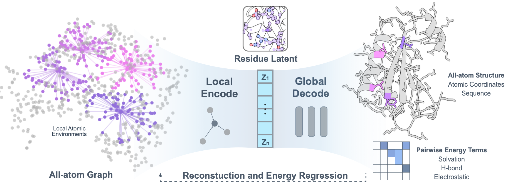

<div align="center">

# SLAE: Strictly Local All-atom Environment for Protein Representation

[](https://www.biorxiv.org/content/10.1101/2025.10.03.680398v1)
[](LICENSE)
[](https://www.python.org/)



</div>

SLAE is a deep-learning framework that learns **all-atom** representations of
protein structure. An SE(3)-equivariant graph encoder maps a protein's local
atomic environment to atom-, residue-, and graph-level embeddings, and an
all-atom decoder reconstructs full backbone + side-chain coordinates from the
residue embeddings.

This repository is the **public inference release** accompanying the paper. It
provides the pretrained autoencoder together with a small API for two tasks:

- **Encode** — turn a protein structure into atom / residue / graph embeddings.
- **Encode → Decode** — reconstruct all-atom coordinates from those embeddings.

---

## Table of Contents

- [Installation](#installation)
- [Pretrained checkpoints](#pretrained-checkpoints)
- [Quickstart](#quickstart)
- [Repository structure](#repository-structure)
- [Data format](#data-format)
- [Citation](#citation)
- [License](#license)
- [Contact](#contact)

## Installation

SLAE depends on PyTorch and the PyTorch Geometric companion libraries
(`torch-scatter`, `torch-cluster`, `torch-sparse`), which are distributed as
build-specific wheels, and `atomworks` pulls in **RDKit**, which is most reliably
installed from `conda-forge`. **Conda is therefore the recommended install path.**

The examples below target PyTorch 2.6 + CUDA 12.4; adjust the version tag for
your system (see the [PyG install docs](https://pytorch-geometric.readthedocs.io/en/latest/install/installation.html)).

### Option A — conda (recommended)

```bash
# Creates the `slae` env with RDKit/biotite from conda-forge.
conda env create -f environment.yml      # mamba env create ... is faster
conda activate slae

# PyG companion wheels matching your torch + CUDA build:
pip install torch-scatter torch-cluster torch-sparse \
    -f https://data.pyg.org/whl/torch-2.6.0+cu124.html

pip install -e .
```

### Option B — pip / uv

The pure-pip path works **only if a compatible RDKit wheel is available for your
platform** (RDKit is a transitive dependency via `atomworks`). If `pip` cannot
resolve `rdkit`, use the conda path above, or provide RDKit some other way first.

```bash
# 1. PyTorch (pick the build for your platform/CUDA)
pip install torch==2.6.0

# 2. PyG companion wheels matching your torch + CUDA, resolved together with
#    SLAE so the numpy<2 pin is honored:
pip install -e . \
    -f https://data.pyg.org/whl/torch-2.6.0+cu124.html \
    --prefer-binary
# (uv: uv pip install -e . -f https://data.pyg.org/whl/torch-2.6.0+cu124.html)
```

> `torch-geometric` is pinned to `2.7.0`: version 2.8 routes `radius_graph`
> through `pyg-lib`, while the featurizer uses the `torch_cluster`-backed
> implementation from 2.7.

Verify the install:

```bash
python -c "import SLAE; print(SLAE.__version__)"
pytest -q          # smoke tests (the checkpoint test skips until weights are pulled)
```

> This release was validated end-to-end on Python 3.12 / PyTorch 2.6.0+cu124 in
> a fresh conda environment (encode + encode→decode on a real structure).

## Pretrained checkpoints

Checkpoints are tracked with [Git LFS](https://git-lfs.com/). After cloning:

```bash
git lfs install
git lfs pull
```

| File | Description |
|------|-------------|
| `checkpoints/autoencoder.ckpt` | Base autoencoder. |
| `checkpoints/autoencoder_pdb.ckpt` | Fine-tuned on the PDB for better performance on larger structures. |

A checkpoint stores the encoder and decoder weights. Two layouts are accepted by
the loader: `{"encoder": ..., "decoder": ...}`, or a Lightning-style
`{"state_dict": ...}` with `encoder.` / `decoder.allatom_decoder.` key prefixes.

## Quickstart

The package exposes a small high-level API — `load_autoencoder`, `encode`, and
`encode_decode`. Both quickstarts below have runnable script equivalents in
[`scripts/`](scripts/).

### Encode

```python
import torch
from SLAE import load_autoencoder, encode
from SLAE.datasets.datamodule import PDBDataModule
from SLAE.features.graph_featurizer import ProteinGraphFeaturizer

device = torch.device("cuda" if torch.cuda.is_available() else "cpu")

encoder, _ = load_autoencoder("checkpoints/autoencoder_pdb.ckpt", device=device)

dm = PDBDataModule(
    pdb_dir="data/pdb_store",
    processed_dir="data/processed",
    inference_only=True,
    batch_size=1,
)
dm.setup(stage="lazy_init")
featurizer = ProteinGraphFeaturizer(radius=8.0, use_atom37=True)

batch = next(iter(dm.inference_dataloader())).to(device)
batch = featurizer(batch)

embeddings = encode(encoder, batch)
embeddings["residue_embedding"]   # (N_residues, 128)
embeddings["node_embedding"]      # (N_atoms, 128)
embeddings["graph_embedding"]     # (1, 128)
```

Or from the command line:

```bash
python scripts/encode_example.py \
    --ckpt checkpoints/autoencoder_pdb.ckpt \
    --pdb-dir data/pdb_store \
    --processed-dir data/processed
```

### Encode → Decode

```python
import torch
from SLAE import load_autoencoder, encode_decode
from SLAE.datasets.datamodule import PDBDataModule
from SLAE.features.graph_featurizer import ProteinGraphFeaturizer
from SLAE.io.write_pdb import to_pdb

device = torch.device("cuda" if torch.cuda.is_available() else "cpu")
encoder, decoder = load_autoencoder("checkpoints/autoencoder_pdb.ckpt", device=device)

dm = PDBDataModule(pdb_dir="data/pdb_store", processed_dir="data/processed",
                   inference_only=True, batch_size=1)
dm.setup(stage="lazy_init")
featurizer = ProteinGraphFeaturizer(radius=8.0, use_atom37=True)

batch = next(iter(dm.inference_dataloader())).to(device)
batch = featurizer(batch)

result = encode_decode(encoder, decoder, batch)
to_pdb(result["coords_per_sample"][0], "decoded_structure.pdb")
```

Or from the command line:

```bash
python scripts/encode_decode_example.py \
    --ckpt checkpoints/autoencoder_pdb.ckpt \
    --pdb-dir data/pdb_store \
    --processed-dir data/processed \
    --out decoded_structure.pdb
```

`encode_decode` returns a dict with `backbone_coords` `[B, N, 4, 3]`,
`sidechain_coords` `[B, N, 33, 3]`, `atom_mask` `[B, N, 37]`, the combined
`allatom_coords` `[B, N, 37, 3]`, and `coords_per_sample` (a list of per-protein
`[N_i, 37, 3]` tensors with invalid atoms masked, ready for `to_pdb`).

## Repository structure

```
SLAE/
├── SLAE/                       # Python package
│   ├── inference.py            # High-level API: load_autoencoder / encode / encode_decode
│   ├── model/                  # encoder.py (ProteinEncoder), decoder.py (AllAtomDecoder)
│   ├── datasets/               # PDBDataModule, dataset, dataloader
│   ├── features/               # ProteinGraphFeaturizer + atom37 featurization
│   ├── nn/                     # equivariant / transformer building blocks
│   ├── io/                     # PDB writing, atom tensors
│   ├── util/                   # constants (atom37 ordering), types, helpers
│   └── configs/                # encoder/ and decoder/ architecture configs (+ dataset reference)
├── scripts/                    # encode_example.py, encode_decode_example.py
├── checkpoints/                # pretrained weights (Git LFS)
├── tests/                      # smoke tests
├── pyproject.toml              # packaging + dependencies
├── requirements.txt            # pip dependency list
└── environment.yml             # conda environment
```

## Data format

- Input structures are standard files (PDB / mmCIF); see
  [Atomworks](https://github.com/RosettaCommons/atomworks) for the full list of supported formats.
- Structures are parsed into PyTorch Geometric `Data` objects and featurized into
  the **atom37** representation (a standardized 37-atom ordering per residue).
- `ProteinGraphFeaturizer(radius=8.0, use_atom37=True)` builds the local radius
  graph the encoder consumes.

## Citation

If you use SLAE in your research, please cite:

```bibtex
@article{chen2025slae,
  title   = {Strictly Local All-atom Environment for Protein Representation},
  author  = {Chen, Yilin and others},
  journal = {bioRxiv},
  year    = {2025},
  doi     = {10.1101/2025.10.03.680398},
  url     = {https://www.biorxiv.org/content/10.1101/2025.10.03.680398v1}
}
```

## License

Released under the [Apache License 2.0](LICENSE).

## Contact

Questions and issues are welcome via the issue tracker, or contact
Yilin Chen (`yilinc5@stanford.edu`).
